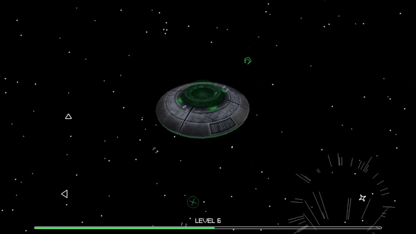

# GEOSTORM

A fast space shooter game made in C# using [Raylib 4.0](https://www.raylib.com/).



## Play

You can play directly the game by getting the binary from the [release](https://github.com/vegasword/Geostorm/releases/tag/v1.0.0) page.

## Build

To build the game, launch it from the solution in your IDE or in a command prompt from the project's root, execute the following command:

```shell
dotnet run Geostorm.sln
```
